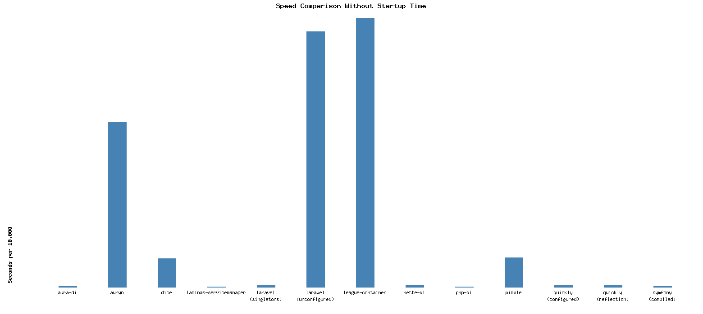
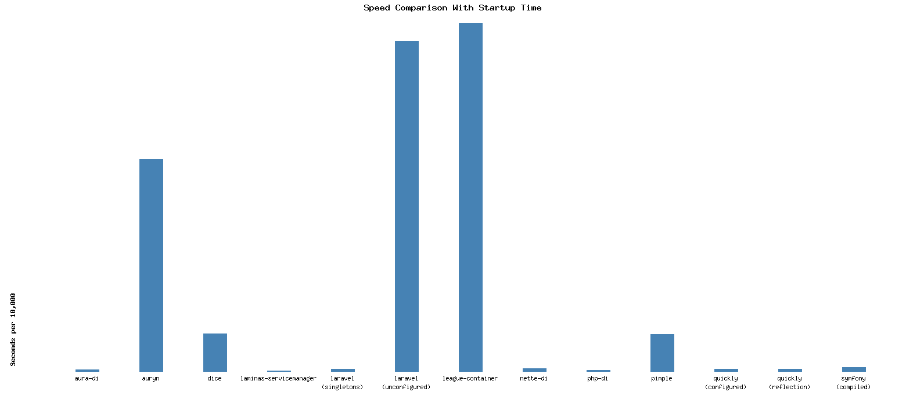
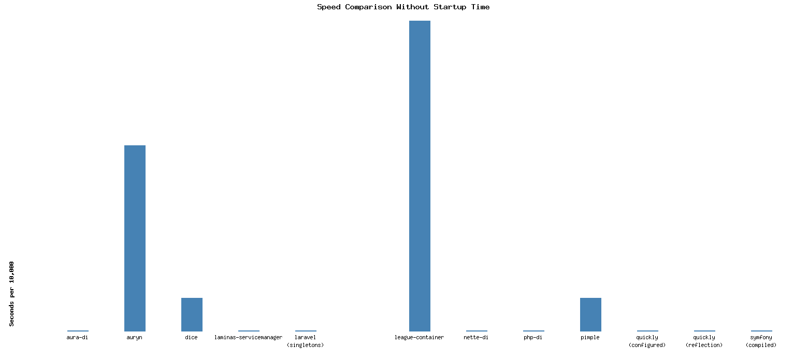
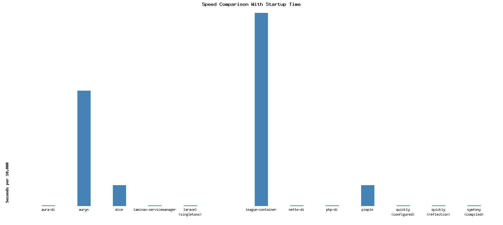
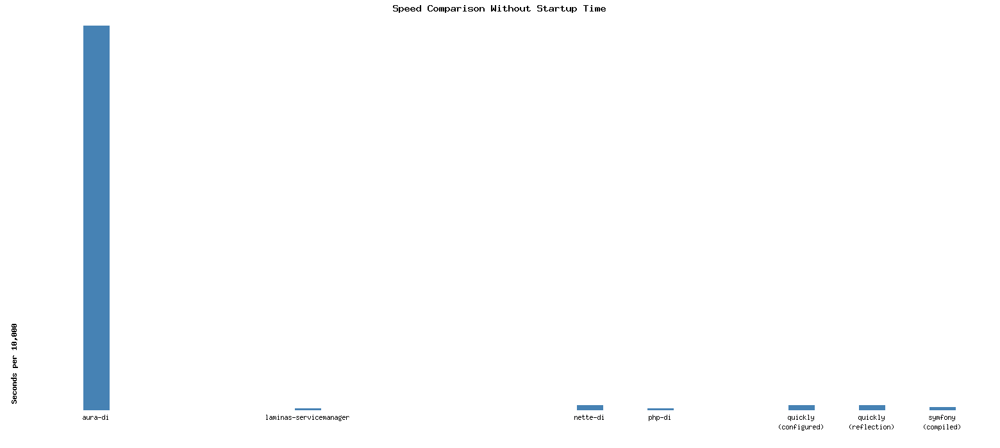
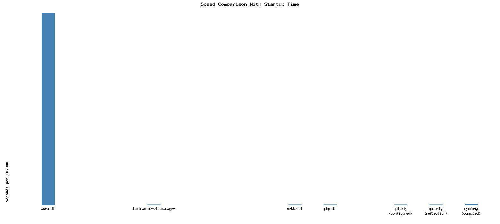

# PHP Dependency Injection Benchmark

This repository benchmarks different dependency injection containers.

Tested with PHP 8.3.6.

## Dependency Versions

- **aura-di**
  - `aura/di`: `^5.0`

- **auryn**
  - `rdlowrey/auryn`: `^1.4`

- **dice**
  - `level-2/dice`: `^4.0`

- **laminas-servicemanager**
  - `laminas/laminas-servicemanager`: `^3.21`

- **laravel(singletons)**
  - `illuminate/container`: `^12.28`

- **laravel(unconfigured)**
  - `illuminate/container`: `^12.28`

- **league-container**
  - `league/container`: `^5.1`

- **nette-di**
  - `nette/di`: `^3.2`

- **php-di**
  - `php-di/php-di`: `^7.0`

- **pimple**
  - `pimple/pimple`: `^3.5`

- **quickly(configured)**
  - `idrinth/quickly`: `dev-master`

- **quickly(reflection)**
  - `idrinth/quickly`: `dev-master`

- **symfony(compiled)**
  - `symfony/dependency-injection`: `^7.0`

## f06

| Container | Average | Minimum | Maximum |
| --- | --- | --- | --- |
| aura-di | 0.0015590906143188 | 0.0015320777893066 | 0.0017080307006836 |
| auryn | 0.40778200626373 | 0.39959001541138 | 0.41476702690125 |
| dice | 0.070824289321899 | 0.069384098052979 | 0.072872161865234 |
| laminas-servicemanager | 0.00078611373901367 | 0.00076889991760254 | 0.00081491470336914 |
| laravel(singletons) | 0.0038207769393921 | 0.0034129619598389 | 0.0068109035491943 |
| laravel(unconfigured) | 0.63166763782501 | 0.62545704841614 | 0.63573288917542 |
| league-container | 0.66589467525482 | 0.65942788124084 | 0.67014503479004 |
| nette-di | 0.0049718141555786 | 0.0033199787139893 | 0.0071678161621094 |
| php-di | 0.00083878040313721 | 0.00078177452087402 | 0.0012469291687012 |
| pimple | 0.072901582717896 | 0.069854974746704 | 0.081990957260132 |
| quickly(configured) | 0.0038470983505249 | 0.0038189888000488 | 0.003960132598877 |
| quickly(reflection) | 0.003882622718811 | 0.0038220882415771 | 0.0040199756622314 |
| symfony(compiled) | 0.0023445844650269 | 0.0020749568939209 | 0.0033869743347168 |

## f06 startup

| Container | Average | Minimum | Maximum |
| --- | --- | --- | --- |
| aura-di | 0.0031910419464111 | 0.0029480457305908 | 0.0052180290222168 |
| auryn | 0.40666129589081 | 0.40203785896301 | 0.41143798828125 |
| dice | 0.071342396736145 | 0.07079005241394 | 0.072817087173462 |
| laminas-servicemanager | 0.00085997581481934 | 0.00076794624328613 | 0.0016369819641113 |
| laravel(singletons) | 0.003755521774292 | 0.0034341812133789 | 0.0048458576202393 |
| laravel(unconfigured) | 0.6334333896637 | 0.62699294090271 | 0.64176297187805 |
| league-container | 0.66829636096954 | 0.65844988822937 | 0.69296002388 |
| nette-di | 0.0054970741271973 | 0.0034120082855225 | 0.023850917816162 |
| php-di | 0.0017730474472046 | 0.0013689994812012 | 0.0052330493927002 |
| pimple | 0.070558047294617 | 0.069007873535156 | 0.071230888366699 |
| quickly(configured) | 0.0039480924606323 | 0.0038051605224609 | 0.0044949054718018 |
| quickly(reflection) | 0.0039572954177856 | 0.0038540363311768 | 0.0045220851898193 |
| symfony(compiled) | 0.0072734594345093 | 0.005748987197876 | 0.020192861557007 |

## p16

| Container | Average | Minimum | Maximum |
| --- | --- | --- | --- |
| aura-di | 0.0019338846206665 | 0.0015270709991455 | 0.0052869319915771 |
| auryn | 56.705908060074 | 56.248876810074 | 57.622673988342 |
| dice | 10.035437989235 | 9.8827369213104 | 10.124573945999 |
| laminas-servicemanager | 0.00087039470672607 | 0.00075888633728027 | 0.0012221336364746 |
| laravel(singletons) | 0.0044512271881104 | 0.0036308765411377 | 0.0068089962005615 |
| laravel(unconfigured) | 0 | 0 | 0 |
| league-container | 94.844452118874 | 94.106081962585 | 96.29585313797 |
| nette-di | 0.0036669969558716 | 0.0033271312713623 | 0.0058939456939697 |
| php-di | 0.00089738368988037 | 0.00081396102905273 | 0.0013790130615234 |
| pimple | 9.9947992801666 | 9.8924000263214 | 10.130399942398 |
| quickly(configured) | 0.0037946939468384 | 0.0037541389465332 | 0.0038328170776367 |
| quickly(reflection) | 0.0038631916046143 | 0.003795862197876 | 0.0042440891265869 |
| symfony(compiled) | 0.002089262008667 | 0.002032995223999 | 0.0021929740905762 |

## p16 startup

| Container | Average | Minimum | Maximum |
| --- | --- | --- | --- |
| aura-di | 0.0053658723831177 | 0.0050950050354004 | 0.0066230297088623 |
| auryn | 56.656388378143 | 56.226051092148 | 57.344885826111 |
| dice | 10.042394113541 | 9.9611639976501 | 10.158607959747 |
| laminas-servicemanager | 0.00092177391052246 | 0.00079894065856934 | 0.0017480850219727 |
| laravel(singletons) | 0.0053400278091431 | 0.0047750473022461 | 0.0083370208740234 |
| laravel(unconfigured) | 0 | 0 | 0 |
| league-container | 94.996136784554 | 94.263011932373 | 95.911834001541 |
| nette-di | 0.0056049585342407 | 0.0034329891204834 | 0.024930000305176 |
| php-di | 0.0011342763900757 | 0.0008690357208252 | 0.0033588409423828 |
| pimple | 9.9786414384842 | 9.8291258811951 | 10.314263105392 |
| quickly(configured) | 0.0040585994720459 | 0.0039639472961426 | 0.0045969486236572 |
| quickly(reflection) | 0.0039794206619263 | 0.0039000511169434 | 0.0045230388641357 |
| symfony(compiled) | 0.0071637868881226 | 0.0057368278503418 | 0.018481969833374 |

## z26

| Container | Average | Minimum | Maximum |
| --- | --- | --- | --- |
| aura-di | 0.33791553974152 | 0.0015559196472168 | 3.3648850917816 |
| auryn | 0 | 0 | 0 |
| dice | 0 | 0 | 0 |
| laminas-servicemanager | 0.00076084136962891 | 0.0007319450378418 | 0.00084900856018066 |
| laravel(singletons) | 0 | 0 | 0 |
| laravel(unconfigured) | 0 | 0 | 0 |
| league-container | 0 | 0 | 0 |
| nette-di | 0.0034701108932495 | 0.0034401416778564 | 0.0035719871520996 |
| php-di | 0.00088863372802734 | 0.00081992149353027 | 0.0013210773468018 |
| pimple | 0 | 0 | 0 |
| quickly(configured) | 0.0039173364639282 | 0.0037949085235596 | 0.0045828819274902 |
| quickly(reflection) | 0.0038805961608887 | 0.0037860870361328 | 0.0041818618774414 |
| symfony(compiled) | 0.0021754503250122 | 0.0021030902862549 | 0.0022680759429932 |

## z26 startup

| Container | Average | Minimum | Maximum |
| --- | --- | --- | --- |
| aura-di | 3.451741194725 | 3.4258580207825 | 3.4736959934235 |
| auryn | 0 | 0 | 0 |
| dice | 0 | 0 | 0 |
| laminas-servicemanager | 0.00099267959594727 | 0.00086498260498047 | 0.0017509460449219 |
| laravel(singletons) | 0 | 0 | 0 |
| laravel(unconfigured) | 0 | 0 | 0 |
| league-container | 0 | 0 | 0 |
| nette-di | 0.0054777145385742 | 0.0034260749816895 | 0.023593902587891 |
| php-di | 0.0012183666229248 | 0.00092220306396484 | 0.0033731460571289 |
| pimple | 0 | 0 | 0 |
| quickly(configured) | 0.0039463996887207 | 0.0038340091705322 | 0.004626989364624 |
| quickly(reflection) | 0.0040472984313965 | 0.0039341449737549 | 0.0045919418334961 |
| symfony(compiled) | 0.007515811920166 | 0.0058369636535645 | 0.018733978271484 |

