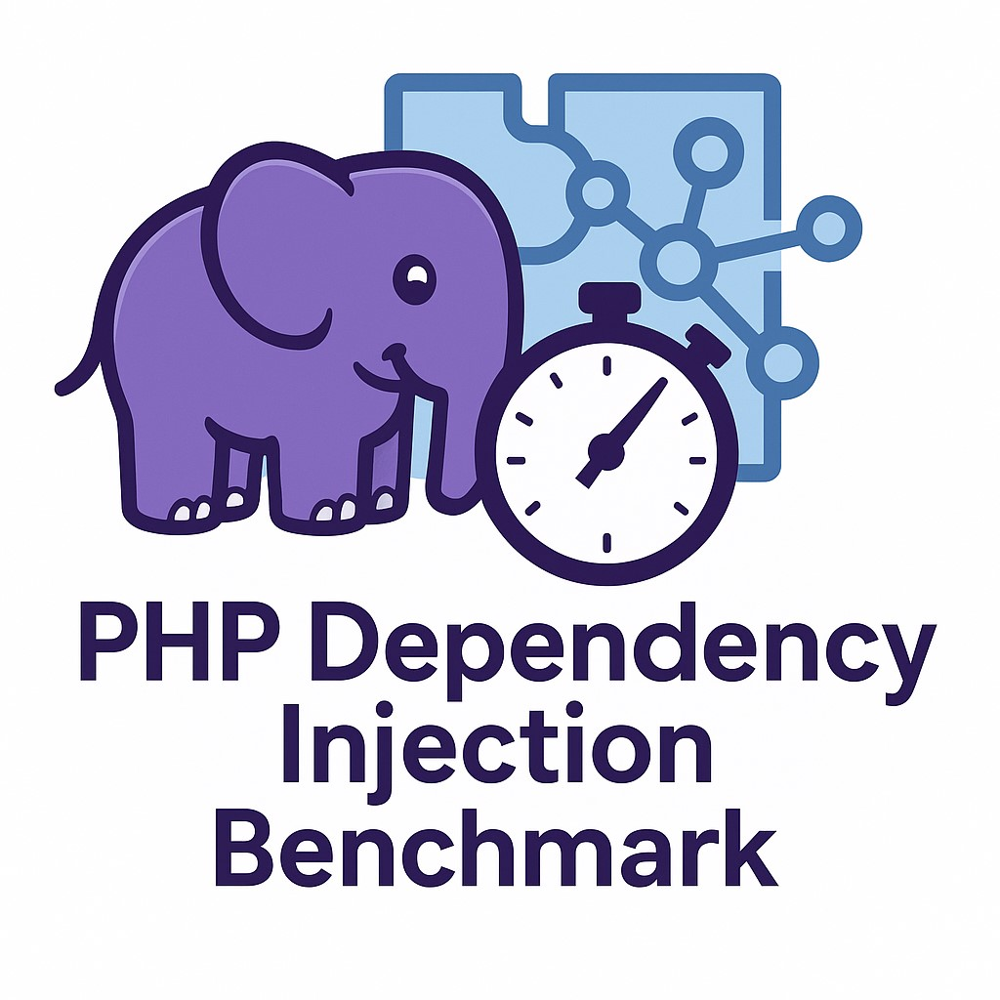
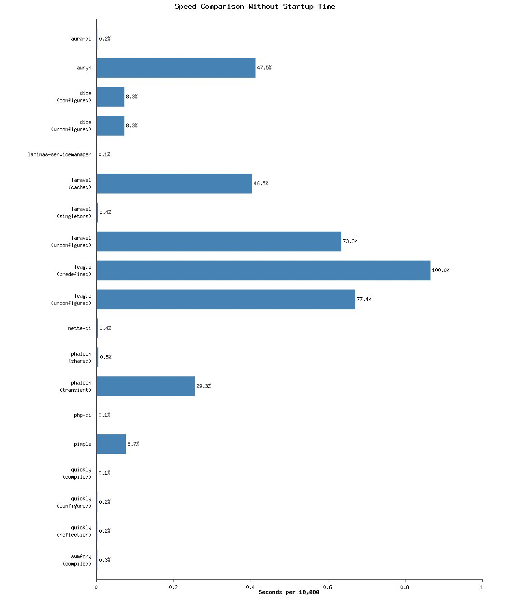
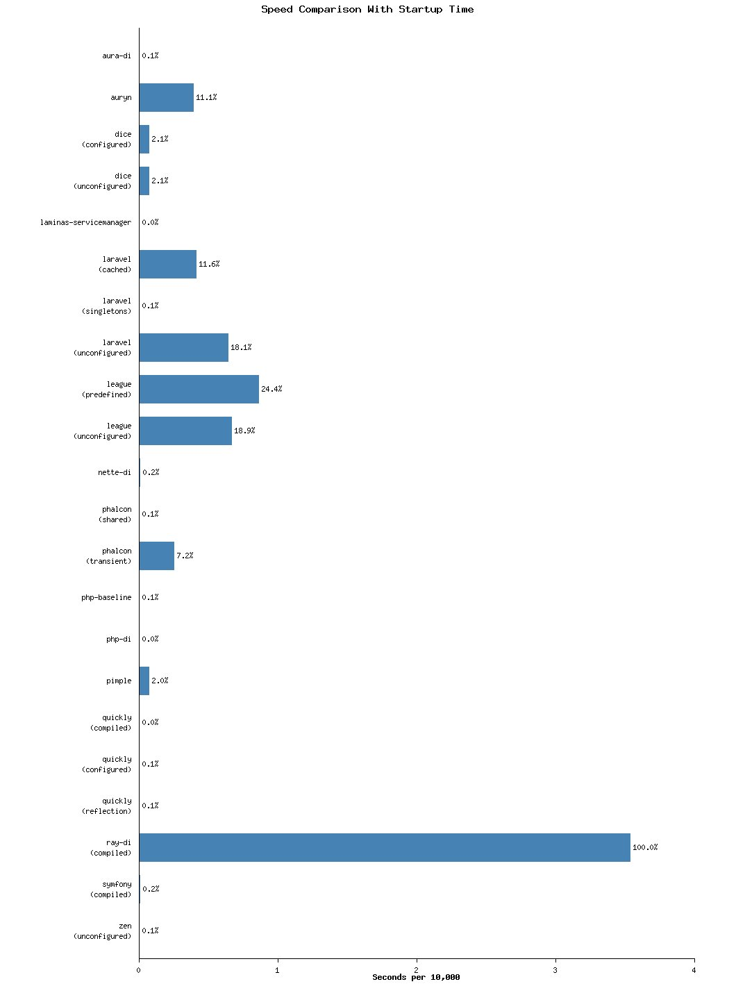
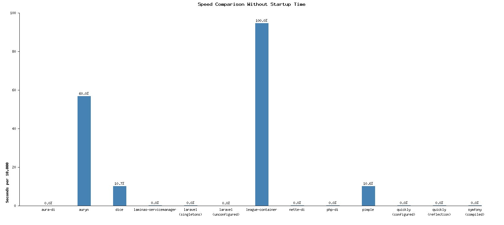
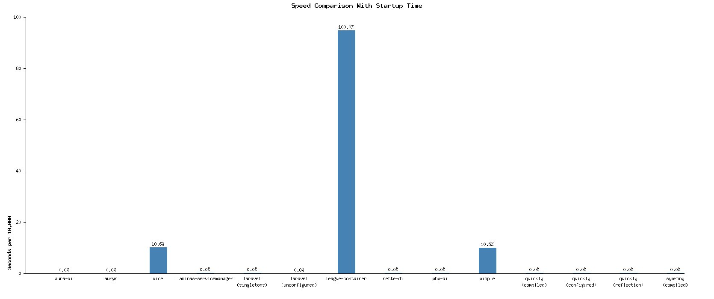
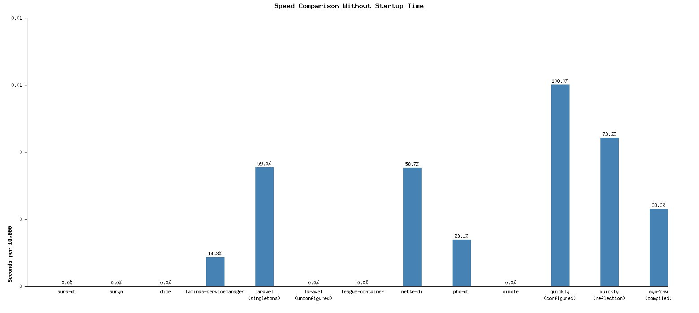
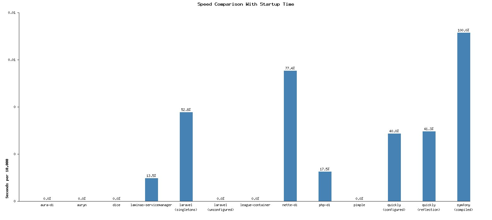

# PHP Dependency Injection Benchmark

  



Dependency injection (DI) containers manage the creation and wiring of object dependencies, allowing applications to remain decoupled and easier to maintain.
Testing these containers verifies that they resolve dependencies correctly and perform efficiently, which is vital for application reliability.

This repository benchmarks different dependency injection containers.

**The "quickly" container is maintained by the same author as this benchmark, and the results may be unconsciously biased.**

To reduce favoritism, results are averaged over multiple runs and, where possible, multiple configurations of each container are benchmarked.

Detailed benchmark data, including environment details and dependency versions, is available in [`run_summary.yaml`](run_summary.yaml).
Raw outputs for each monthly run are archived under the [`archive`](archive) directory with date-based subdirectories.

## 📂 Test Files

The benchmark defines three dependency graphs used for testing.

- `src/classes-06.php` (`f06`): 6 classes.
- `src/classes-16.php` (`p16`): 16 classes.
- `src/classes-26.php` (`z26`): 26 classes.

The class names (`f06`, `p16`, `z26`) follow a group-unique letter plus total class count in the group to avoid overlap.

Each file contains all required classes and avoids autoloading so that container performance measurements exclude file-loading overhead.
Each test is executed with and without container startup time to measure resolution speed and initialization cost.

## 🚀 Running individual benchmarks

Build the container and execute a benchmark using docker:

```sh
docker build -t di-benchmark-php-di -f containers/php-di/Dockerfile .
docker run --rm -v "$PWD:/out" di-benchmark-php-di php benchmark.php f06 1
```

The build step prepares the image for the chosen container, and the run command executes a single run of the specified test (for example, `f06`). The resulting `results.json` file will be written to the current directory.

Some containers perform extra work during the image build; for example, `ray-di.compiled` precompiles its dependencies automatically.

## 🧩 Containers

| Container | Features |
| --- | --- |
| [Aura.Di](https://github.com/auraphp/Aura.Di) | Configurable DI container with lazy loading and service factories |
| [PHP-DI](https://github.com/PHP-DI/PHP-DI) | Autowiring, annotations, and compiled container support |
| [Pimple](https://github.com/silexphp/Pimple) | Lightweight closure-based container |
| [Symfony DI](https://github.com/symfony/dependency-injection) | Feature-rich container with configuration and compilation |
| [Laravel Container](https://github.com/laravel/framework) | Framework-integrated container with automatic resolution and binding |
| [Nette DI](https://github.com/nette/di) | High-performance compiled container |
| [Auryn](https://github.com/rdlowrey/auryn) | Auryn is a dependency injector for bootstrapping object-oriented PHP applications. |
| [Dice](https://github.com/Level-2/Dice) | A minimalist dependency injection container for PHP. |
| [Laminas ServiceManager](https://github.com/laminas/laminas-servicemanager) | Factory-driven dependency injection container |
| [League Container](https://github.com/thephpleague/container) | A fast and intuitive dependency injection container. |
| [Phalcon](https://github.com/phalcon/cphalcon) | A PHP extension built for performance |
| [PHP (baseline)](https://www.php.net/) | Manual instantiation of dependencies without a container |
| [Quickly](https://github.com/Idrinth/quickly) | A fast dependency injection container featuring build time resolution. |
| [Ray.Di](https://github.com/ray-di/Ray.Di) | DI and AOP framework for PHP inspired by Google Guice |
| [Zen](https://github.com/woohoolabs/zen) | Woohoo Labs. Zen DI Container and preload file generator |
## Latest Results

Run from 2025-09-09

### 📊 f06

Small dependency graph including 6 classes total (excluding container startup time)



<details>
<summary>View results</summary>

| Container | Version | Average | Minimum | Maximum |
| --- | --- | --- | --- | --- |
| Aura-di(Configured, Transient) | ^5.0 | 1ms, 795µs, 887ns | 1ms, 543µs, 998ns | 2ms, 680µs, 63ns |
| Auryn(Reflection, Transient) | ^1.4 | 409ms, 724µs, 473ns | 399ms, 524µs, 927ns | 424ms, 890µs, 995ns |
| Dice(Configured, Singleton) | ^4.0 | 70ms, 570µs, 611ns | 69ms, 297µs, 75ns | 75ms, 520µs, 38ns |
| Dice(Reflection, Transient) | ^4.0 | 70ms, 626µs, 664ns | 69ms, 112µs, 62ns | 77ms, 277µs, 183ns |
| Laminas-servicemanager(Reflection, Singleton) | ^4.4 | 793µs, 51ns | 769µs, 138ns | 828µs, 981ns |
| Laravel(Configured, Transient) | ^12.28 | 407ms, 786µs, 250ns | 403ms, 738µs, 21ns | 418ms, 646µs, 812ns |
| Laravel(Reflection, Singleton) | ^12.28 | 3ms, 482µs, 818ns | 3ms, 427µs, 28ns | 3ms, 676µs, 176ns |
| Laravel(Reflection, Transient) | ^12.28 | 637ms, 319µs, 827ns | 625ms, 458µs, 2ns | 652ms, 974µs, 843ns |
| League(Configured, Transient) | ^5.1 | 867ms, 364µs, 692ns | 856ms, 175µs, 899ns | 906ms, 84µs, 60ns |
| League(Reflection, Transient) | ^5.1 | 670ms, 630µs, 407ns | 655ms, 167µs, 818ns | 696ms, 769µs, 952ns |
| Nette-di(Compiled, Singleton) | ^3.2 | 3ms, 341µs, 698ns | 3ms, 232µs, 955ns | 3ms, 477µs, 96ns |
| Phalcon(Configured, Singleton) | ^5 | 4ms, 5µs, 98ns | 3ms, 949µs, 165ns | 4ms, 56µs, 930ns |
| Phalcon(Configured, Transient) | ^5 | 253ms, 423µs, 929ns | 249ms, 835µs, 14ns | 263ms, 651µs, 132ns |
| Php-baseline |  | 3ms, 883µs, 576ns | 3ms, 781µs, 80ns | 4ms, 22µs, 836ns |
| Php-di(Reflection, Singleton) | ^7.0 | 861µs, 48ns | 793µs, 933ns | 1ms, 246µs, 929ns |
| Pimple(Configured, Transient) | ^3.5 | 70ms, 522µs, 308ns | 68ms, 978µs, 71ns | 72ms, 611µs, 93ns |
| Pimple(Configured, Singleton) | ^3.5 | 1ms, 293µs, 110ns | 1ms, 224µs, 994ns | 1ms, 692µs, 56ns |
| Quickly(Compiled, Singleton) | dev-master | 802µs, 564ns | 792µs, 26ns | 824µs, 928ns |
| Quickly(Configured, Singleton) | dev-master | 1ms, 404µs, 833ns | 1ms, 327µs, 37ns | 1ms, 733µs, 64ns |
| Quickly(Reflection, Singleton) | dev-master | 1ms, 361µs, 656ns | 1ms, 317µs, 24ns | 1ms, 478µs, 195ns |
| Ray-di(Compiled, Transient) | ^2.16 | 3s, 501ms, 11µs, 538ns | 3s, 418ms, 890µs, 953ns | 3s, 558ms, 672µs, 904ns |
| Ray-di(Reflection, Transient) | ^2.16 | 349ms, 169µs, 301ns | 348ms, 43µs, 918ns | 350ms, 584µs, 983ns |
| Symfony(Compiled, Singleton) | ^7.0 | 797µs, 605ns | 781µs, 59ns | 811µs, 100ns |
| Zen(Compiled, Singleton) | ^3.1 | 868µs, 892ns | 771µs, 45ns | 1ms, 475µs, 95ns |

</details>

### 🚀 f06 startup

Small dependency graph including 6 classes total (includes container startup time)



<details>
<summary>View results</summary>

| Container | Version | Average | Minimum | Maximum |
| --- | --- | --- | --- | --- |
| Aura-di(Configured, Transient) | ^5.0 | 2ms, 130µs, 7ns | 1ms, 660µs, 108ns | 3ms, 117µs, 84ns |
| Auryn(Reflection, Transient) | ^1.4 | 407ms, 420µs, 516ns | 403ms, 722µs, 47ns | 420ms, 382µs, 976ns |
| Dice(Configured, Singleton) | ^4.0 | 71ms, 931µs, 982ns | 70ms, 199µs, 966ns | 74ms, 281µs, 930ns |
| Dice(Reflection, Transient) | ^4.0 | 72ms, 460µs, 79ns | 69ms, 568µs, 872ns | 78ms, 819µs, 36ns |
| Laminas-servicemanager(Reflection, Singleton) | ^4.4 | 961µs, 804ns | 817µs, 775ns | 2ms, 74µs, 956ns |
| Laravel(Configured, Transient) | ^12.28 | 405ms, 34µs, 41ns | 401ms, 201µs, 963ns | 408ms, 200µs, 25ns |
| Laravel(Reflection, Singleton) | ^12.28 | 3ms, 711µs, 104ns | 3ms, 533µs, 840ns | 4ms, 801µs, 988ns |
| Laravel(Reflection, Transient) | ^12.28 | 640ms, 807µs, 8ns | 628ms, 866µs, 910ns | 685ms, 482µs, 978ns |
| League(Configured, Transient) | ^5.1 | 866ms, 376µs, 876ns | 852ms, 240µs, 85ns | 884ms, 186µs, 29ns |
| League(Reflection, Transient) | ^5.1 | 665ms, 705µs, 490ns | 659ms, 151µs, 792ns | 673ms, 441µs, 171ns |
| Nette-di(Compiled, Singleton) | ^3.2 | 7ms, 943µs, 439ns | 3ms, 359µs, 79ns | 28ms, 46µs, 131ns |
| Phalcon(Configured, Singleton) | ^5 | 4ms, 110µs, 121ns | 3ms, 993µs, 34ns | 4ms, 418µs, 134ns |
| Phalcon(Configured, Transient) | ^5 | 256ms, 861µs, 996ns | 254ms, 719µs, 972ns | 263ms, 251µs, 66ns |
| Php-baseline |  | 3ms, 912µs, 591ns | 3ms, 855µs, 943ns | 3ms, 957µs, 33ns |
| Php-di(Reflection, Singleton) | ^7.0 | 1ms, 171µs, 898ns | 880µs, 2ns | 3ms, 493µs, 70ns |
| Pimple(Configured, Transient) | ^3.5 | 72ms, 173µs, 47ns | 68ms, 692µs, 922ns | 82ms, 589µs, 149ns |
| Pimple(Configured, Singleton) | ^3.5 | 1ms, 655µs, 840ns | 1ms, 501µs, 83ns | 2ms, 624µs, 34ns |
| Quickly(Compiled, Singleton) | dev-master | 842µs, 666ns | 825µs, 881ns | 856µs, 161ns |
| Quickly(Configured, Singleton) | dev-master | 1ms, 787µs, 686ns | 1ms, 679µs, 182ns | 2ms, 479µs, 76ns |
| Quickly(Reflection, Singleton) | dev-master | 1ms, 474µs, 285ns | 1ms, 370µs, 906ns | 2ms, 207µs, 994ns |
| Ray-di(Compiled, Transient) | ^2.16 | 3s, 504ms, 342µs, 722ns | 3s, 463ms, 605µs, 165ns | 3s, 574ms, 495µs, 77ns |
| Ray-di(Reflection, Transient) | ^2.16 | 364ms, 681µs, 816ns | 349ms, 117µs, 994ns | 448ms, 476µs, 76ns |
| Symfony(Compiled, Singleton) | ^7.0 | 807µs, 261ns | 772µs, 953ns | 849µs, 962ns |
| Zen(Compiled, Singleton) | ^3.1 | 1ms, 12µs, 134ns | 808µs, 954ns | 2ms, 724µs, 885ns |

</details>

### 📊 p16

Medium size dependency graph including 16 classes total. Skipped for the slowest DI-Containers for runtime reasons. (excluding container startup time)



<details>
<summary>View results</summary>

| Container | Version | Average | Minimum | Maximum |
| --- | --- | --- | --- | --- |
| Aura-di(Configured, Transient) | ^5.0 | 5ms, 792µs, 927ns | 5ms, 223µs, 989ns | 10ms, 246µs, 38ns |
| Auryn(Reflection, Transient) | ^1.4 | 56s, 990ms, 95µs, 19ns | 56s, 513ms, 566µs, 17ns | 57s, 466ms, 495µs, 990ns |
| Laminas-servicemanager(Reflection, Singleton) | ^4.4 | 851µs, 821ns | 749µs, 111ns | 1ms, 240µs, 968ns |
| Laravel(Configured, Transient) | ^12.28 | 56s, 160ms, 670µs, 948ns | 55s, 578ms, 326µs, 225ns | 56s, 952ms, 974µs, 81ns |
| Laravel(Reflection, Singleton) | ^12.28 | 3ms, 412µs, 365ns | 3ms, 345µs, 966ns | 3ms, 624µs, 916ns |
| Nette-di(Compiled, Singleton) | ^3.2 | 3ms, 414µs, 583ns | 3ms, 315µs, 925ns | 3ms, 689µs, 50ns |
| Phalcon(Configured, Singleton) | ^5 | 4ms, 496µs, 932ns | 3ms, 976µs, 106ns | 8ms, 172µs, 35ns |
| Phalcon(Configured, Transient) | ^5 | 35s, 555ms, 181µs, 193ns | 35s, 173ms, 144µs, 817ns | 35s, 995ms, 317µs, 935ns |
| Php-baseline |  | 10ms, 255µs, 98ns | 9ms, 954µs, 929ns | 11ms, 70µs, 966ns |
| Php-di(Reflection, Singleton) | ^7.0 | 862µs, 979ns | 785µs, 112ns | 1ms, 270µs, 55ns |
| Quickly(Compiled, Singleton) | dev-master | 787µs, 258ns | 760µs, 793ns | 923µs, 156ns |
| Quickly(Configured, Singleton) | dev-master | 1ms, 350µs, 784ns | 1ms, 327µs, 991ns | 1ms, 393µs, 79ns |
| Quickly(Reflection, Singleton) | dev-master | 1ms, 364µs, 517ns | 1ms, 317µs, 24ns | 1ms, 574µs, 993ns |
| Ray-di(Reflection, Transient) | ^2.16 | 49s, 880ms, 902µs, 28ns | 49s, 290ms, 699µs, 5ns | 50s, 295ms, 670µs, 986ns |
| Symfony(Compiled, Singleton) | ^7.0 | 1ms, 333µs, 999ns | 1ms, 313µs, 924ns | 1ms, 356µs, 840ns |
| Zen(Compiled, Singleton) | ^3.1 | 848µs, 269ns | 741µs, 958ns | 1ms, 521µs, 825ns |

</details>

### 🚀 p16 startup

Medium size dependency graph including 16 classes total. Skipped for the slowest DI-Containers for runtime reasons. (includes container startup time)



<details>
<summary>View results</summary>

| Container | Version | Average | Minimum | Maximum |
| --- | --- | --- | --- | --- |
| Aura-di(Configured, Transient) | ^5.0 | 6ms, 737µs, 17ns | 6ms, 630µs, 182ns | 6ms, 891µs, 12ns |
| Auryn(Reflection, Transient) | ^1.4 | 57s, 200ms, 381µs, 302ns | 56s, 563ms, 571µs, 929ns | 58s, 81ms, 128µs, 120ns |
| Laminas-servicemanager(Reflection, Singleton) | ^4.4 | 982µs, 904ns | 842µs, 809ns | 2ms, 77µs, 102ns |
| Laravel(Configured, Transient) | ^12.28 | 56s, 492ms, 254µs, 447ns | 55s, 797ms, 430µs, 992ns | 57s, 714ms, 533µs, 90ns |
| Laravel(Reflection, Singleton) | ^12.28 | 5ms, 430µs, 316ns | 3ms, 535µs, 985ns | 6ms, 659µs, 984ns |
| Nette-di(Compiled, Singleton) | ^3.2 | 25ms, 653µs, 123ns | 23ms, 413µs, 896ns | 32ms, 223µs, 224ns |
| Phalcon(Configured, Singleton) | ^5 | 4ms, 597µs, 258ns | 4ms, 78µs, 149ns | 8ms, 172µs, 988ns |
| Phalcon(Configured, Transient) | ^5 | 35s, 235ms, 292µs, 935ns | 35s, 122ms, 87µs, 955ns | 35s, 425ms, 234µs, 79ns |
| Php-baseline |  | 11ms, 296µs, 391ns | 9ms, 840µs, 965ns | 18ms, 268µs, 823ns |
| Php-di(Reflection, Singleton) | ^7.0 | 1ms, 122µs, 307ns | 855µs, 922ns | 3ms, 345µs, 12ns |
| Quickly(Compiled, Singleton) | dev-master | 807µs, 905ns | 792µs, 980ns | 841µs, 856ns |
| Quickly(Configured, Singleton) | dev-master | 1ms, 789µs, 402ns | 1ms, 680µs, 135ns | 2ms, 474µs, 69ns |
| Quickly(Reflection, Singleton) | dev-master | 1ms, 500µs, 344ns | 1ms, 405µs | 2ms, 262µs, 830ns |
| Ray-di(Reflection, Transient) | ^2.16 | 49s, 830ms, 711µs, 746ns | 49s, 420ms, 783µs, 996ns | 50s, 446ms, 308µs, 851ns |
| Symfony(Compiled, Singleton) | ^7.0 | 772µs, 976ns | 753µs, 879ns | 816µs, 822ns |
| Zen(Compiled, Singleton) | ^3.1 | 1ms, 62µs, 393ns | 849µs, 8ns | 2ms, 757µs, 72ns |

</details>

### 📊 z26

Large dependency graph including a total of 26 classes. Skipped for all but the fastest DI-Containers for runtime reasons. (excluding container startup time)



<details>
<summary>View results</summary>

| Container | Version | Average | Minimum | Maximum |
| --- | --- | --- | --- | --- |
| Laminas-servicemanager(Reflection, Singleton) | ^4.4 | 801µs, 229ns | 766µs, 38ns | 983µs, 953ns |
| Laravel(Reflection, Singleton) | ^12.28 | 3ms, 544µs, 664ns | 3ms, 408µs, 908ns | 4ms, 263µs, 877ns |
| Php-di(Reflection, Singleton) | ^7.0 | 879µs, 216ns | 800µs, 132ns | 1ms, 290µs, 82ns |
| Quickly(Compiled, Singleton) | dev-master | 801µs, 682ns | 784µs, 873ns | 815µs, 868ns |
| Quickly(Configured, Singleton) | dev-master | 1ms, 356µs, 673ns | 1ms, 310µs, 825ns | 1ms, 414µs, 60ns |
| Quickly(Reflection, Singleton) | dev-master | 2ms, 297µs, 139ns | 2ms, 216µs, 100ns | 2ms, 741µs, 98ns |
| Symfony(Compiled, Singleton) | ^7.0 | 768µs, 494ns | 751µs, 18ns | 822µs, 67ns |
| Zen(Compiled, Singleton) | ^3.1 | 899µs, 386ns | 802µs, 40ns | 1ms, 615µs, 47ns |

</details>

### 🚀 z26 startup

Large dependency graph including a total of 26 classes. Skipped for all but the fastest DI-Containers for runtime reasons. (includes container startup time)



<details>
<summary>View results</summary>

| Container | Version | Average | Minimum | Maximum |
| --- | --- | --- | --- | --- |
| Laminas-servicemanager(Reflection, Singleton) | ^4.4 | 1ms, 160µs, 669ns | 914µs, 96ns | 2ms, 173µs, 185ns |
| Laravel(Reflection, Singleton) | ^12.28 | 3ms, 734µs, 397ns | 3ms, 564µs, 119ns | 4ms, 796µs, 981ns |
| Php-di(Reflection, Singleton) | ^7.0 | 1ms, 586µs, 723ns | 972µs, 986ns | 3ms, 557µs, 205ns |
| Quickly(Compiled, Singleton) | dev-master | 991µs, 821ns | 843µs, 48ns | 1ms, 218µs, 80ns |
| Quickly(Configured, Singleton) | dev-master | 1ms, 789µs, 498ns | 1ms, 679µs, 897ns | 2ms, 508µs, 878ns |
| Quickly(Reflection, Singleton) | dev-master | 1ms, 722µs, 621ns | 1ms, 499µs, 176ns | 2ms, 480µs, 30ns |
| Symfony(Compiled, Singleton) | ^7.0 | 784µs, 850ns | 765µs, 85ns | 822µs, 67ns |
| Zen(Compiled, Singleton) | ^3.1 | 1ms, 93µs, 220ns | 878µs, 95ns | 2ms, 883µs, 911ns |

</details>

Questions, issues, and new containers are welcome!
