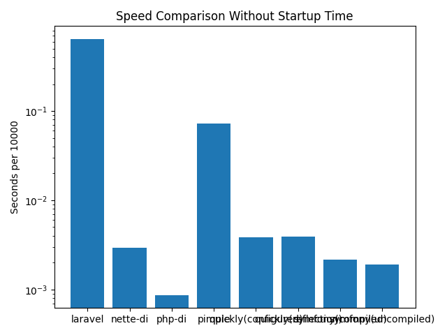

# PHP Dependency Injection Benchmark

This repository benchmarks different dependency injection containers.

## Summary

| Container | Average | Minimum | Maximum |
| --- | --- | --- | --- |
| laravel | 0.64118044376373 | 0.6378800868988 | 0.6502149105072 |
| nette-di | 0.0029871225357056 | 0.0029511451721191 | 0.0030601024627686 |
| php-di | 0.00088047981262207 | 0.00081300735473633 | 0.00091099739074707 |
| pimple | 0.073277139663696 | 0.072731971740723 | 0.074095010757446 |
| quickly(configured) | 0.00386803150177 | 0.0038249492645264 | 0.0039689540863037 |
| quickly(reflection) | 0.0039047956466675 | 0.0038280487060547 | 0.0039999485015869 |
| symfony(compiled) | 0.0026052236557007 | 0.0025708675384521 | 0.002669095993042 |
| symfony(uncompiled) | 0.002310037612915 | 0.002000093460083 | 0.003648042678833 |




## Test Results

Results from the latest automated run of the Dockerized benchmarks
(triggered on pushes to main and a monthly schedule):

### laravel
```
run 0: 0.64173793792725 seconds per 10000
run 1: 0.64319801330566 seconds per 10000
run 2: 0.6550440788269 seconds per 10000
run 3: 0.64172792434692 seconds per 10000
run 4: 0.64135503768921 seconds per 10000
run 5: 0.64002299308777 seconds per 10000
run 6: 0.63880205154419 seconds per 10000
run 7: 0.64144778251648 seconds per 10000
run 8: 0.64092898368835 seconds per 10000
run 9: 0.64162802696228 seconds per 10000

AVERAGE | MINIMUM | MAXIMUM
0.6425892829895 | 0.63880205154419 | 0.6550440788269

INCLUDING STARTUP TIME
run 0: 0.64183878898621 seconds per 10000
run 1: 0.6378800868988 seconds per 10000
run 2: 0.64089202880859 seconds per 10000
run 3: 0.64007782936096 seconds per 10000
run 4: 0.63899087905884 seconds per 10000
run 5: 0.64012980461121 seconds per 10000
run 6: 0.64071607589722 seconds per 10000
run 7: 0.6502149105072 seconds per 10000
run 8: 0.64073801040649 seconds per 10000
run 9: 0.64032602310181 seconds per 10000

AVERAGE | MINIMUM | MAXIMUM
0.64118044376373 | 0.6378800868988 | 0.6502149105072
```

### nette-di
```
run 0: 0.0028390884399414 seconds per 10000
run 1: 0.002953052520752 seconds per 10000
run 2: 0.0029211044311523 seconds per 10000
run 3: 0.0029411315917969 seconds per 10000
run 4: 0.0029101371765137 seconds per 10000
run 5: 0.0029687881469727 seconds per 10000
run 6: 0.002964973449707 seconds per 10000
run 7: 0.0029728412628174 seconds per 10000
run 8: 0.0029420852661133 seconds per 10000
run 9: 0.00301194190979 seconds per 10000

AVERAGE | MINIMUM | MAXIMUM
0.0029425144195557 | 0.0028390884399414 | 0.00301194190979

INCLUDING STARTUP TIME
run 0: 0.0030601024627686 seconds per 10000
run 1: 0.0029511451721191 seconds per 10000
run 2: 0.0029740333557129 seconds per 10000
run 3: 0.0029819011688232 seconds per 10000
run 4: 0.003026008605957 seconds per 10000
run 5: 0.0029778480529785 seconds per 10000
run 6: 0.002979040145874 seconds per 10000
run 7: 0.0029771327972412 seconds per 10000
run 8: 0.0029780864715576 seconds per 10000
run 9: 0.0029659271240234 seconds per 10000

AVERAGE | MINIMUM | MAXIMUM
0.0029871225357056 | 0.0029511451721191 | 0.0030601024627686
```

### php-di
```
run 0: 0.0011889934539795 seconds per 10000
run 1: 0.0011069774627686 seconds per 10000
run 2: 0.00079011917114258 seconds per 10000
run 3: 0.00075602531433105 seconds per 10000
run 4: 0.00078988075256348 seconds per 10000
run 5: 0.0007929801940918 seconds per 10000
run 6: 0.00079011917114258 seconds per 10000
run 7: 0.0007939338684082 seconds per 10000
run 8: 0.00079798698425293 seconds per 10000
run 9: 0.00082921981811523 seconds per 10000

AVERAGE | MINIMUM | MAXIMUM
0.00086362361907959 | 0.00075602531433105 | 0.0011889934539795

INCLUDING STARTUP TIME
run 0: 0.00084710121154785 seconds per 10000
run 1: 0.00090909004211426 seconds per 10000
run 2: 0.00090217590332031 seconds per 10000
run 3: 0.00085592269897461 seconds per 10000
run 4: 0.00081300735473633 seconds per 10000
run 5: 0.00091099739074707 seconds per 10000
run 6: 0.00089883804321289 seconds per 10000
run 7: 0.00090289115905762 seconds per 10000
run 8: 0.00090289115905762 seconds per 10000
run 9: 0.00086188316345215 seconds per 10000

AVERAGE | MINIMUM | MAXIMUM
0.00088047981262207 | 0.00081300735473633 | 0.00091099739074707
```

### pimple
```
run 0: 0.071736097335815 seconds per 10000
run 1: 0.072221994400024 seconds per 10000
run 2: 0.071728944778442 seconds per 10000
run 3: 0.071533203125 seconds per 10000
run 4: 0.071613073348999 seconds per 10000
run 5: 0.071370124816895 seconds per 10000
run 6: 0.07171893119812 seconds per 10000
run 7: 0.07176399230957 seconds per 10000
run 8: 0.071552038192749 seconds per 10000
run 9: 0.071753978729248 seconds per 10000

AVERAGE | MINIMUM | MAXIMUM
0.071699237823486 | 0.071370124816895 | 0.072221994400024

INCLUDING STARTUP TIME
run 0: 0.072818040847778 seconds per 10000
run 1: 0.072731971740723 seconds per 10000
run 2: 0.073384046554565 seconds per 10000
run 3: 0.07283616065979 seconds per 10000
run 4: 0.073457956314087 seconds per 10000
run 5: 0.073018074035645 seconds per 10000
run 6: 0.074095010757446 seconds per 10000
run 7: 0.073053121566772 seconds per 10000
run 8: 0.073477029800415 seconds per 10000
run 9: 0.073899984359741 seconds per 10000

AVERAGE | MINIMUM | MAXIMUM
0.073277139663696 | 0.072731971740723 | 0.074095010757446
```

### quickly(configured)
```
run 0: 0.003842830657959 seconds per 10000
run 1: 0.0038859844207764 seconds per 10000
run 2: 0.0038368701934814 seconds per 10000
run 3: 0.0037951469421387 seconds per 10000
run 4: 0.0038211345672607 seconds per 10000
run 5: 0.0038230419158936 seconds per 10000
run 6: 0.0038168430328369 seconds per 10000
run 7: 0.003809928894043 seconds per 10000
run 8: 0.0037901401519775 seconds per 10000
run 9: 0.0038070678710938 seconds per 10000

AVERAGE | MINIMUM | MAXIMUM
0.0038228988647461 | 0.0037901401519775 | 0.0038859844207764

INCLUDING STARTUP TIME
run 0: 0.0039689540863037 seconds per 10000
run 1: 0.0038461685180664 seconds per 10000
run 2: 0.0038740634918213 seconds per 10000
run 3: 0.0038461685180664 seconds per 10000
run 4: 0.0038521289825439 seconds per 10000
run 5: 0.0038790702819824 seconds per 10000
run 6: 0.0038249492645264 seconds per 10000
run 7: 0.0038480758666992 seconds per 10000
run 8: 0.0038778781890869 seconds per 10000
run 9: 0.0038628578186035 seconds per 10000

AVERAGE | MINIMUM | MAXIMUM
0.00386803150177 | 0.0038249492645264 | 0.0039689540863037
```

### quickly(reflection)
```
run 0: 0.0039350986480713 seconds per 10000
run 1: 0.0040230751037598 seconds per 10000
run 2: 0.003870964050293 seconds per 10000
run 3: 0.003896951675415 seconds per 10000
run 4: 0.0038759708404541 seconds per 10000
run 5: 0.0038721561431885 seconds per 10000
run 6: 0.0038530826568604 seconds per 10000
run 7: 0.0037961006164551 seconds per 10000
run 8: 0.00388503074646 seconds per 10000
run 9: 0.0038259029388428 seconds per 10000

AVERAGE | MINIMUM | MAXIMUM
0.00388343334198 | 0.0037961006164551 | 0.0040230751037598

INCLUDING STARTUP TIME
run 0: 0.0039999485015869 seconds per 10000
run 1: 0.0039510726928711 seconds per 10000
run 2: 0.0038809776306152 seconds per 10000
run 3: 0.0039961338043213 seconds per 10000
run 4: 0.0039269924163818 seconds per 10000
run 5: 0.0038559436798096 seconds per 10000
run 6: 0.0038409233093262 seconds per 10000
run 7: 0.0038750171661377 seconds per 10000
run 8: 0.0038928985595703 seconds per 10000
run 9: 0.0038280487060547 seconds per 10000

AVERAGE | MINIMUM | MAXIMUM
0.0039047956466675 | 0.0038280487060547 | 0.0039999485015869
```

### symfony(compiled)
```
run 0: 0.0021109580993652 seconds per 10000
run 1: 0.0022478103637695 seconds per 10000
run 2: 0.0021839141845703 seconds per 10000
run 3: 0.0021851062774658 seconds per 10000
run 4: 0.0021419525146484 seconds per 10000
run 5: 0.0022280216217041 seconds per 10000
run 6: 0.00217604637146 seconds per 10000
run 7: 0.0021531581878662 seconds per 10000
run 8: 0.002155065536499 seconds per 10000
run 9: 0.0021898746490479 seconds per 10000

AVERAGE | MINIMUM | MAXIMUM
0.0021771907806396 | 0.0021109580993652 | 0.0022478103637695

INCLUDING STARTUP TIME
run 0: 0.002669095993042 seconds per 10000
run 1: 0.0025920867919922 seconds per 10000
run 2: 0.0026218891143799 seconds per 10000
run 3: 0.0025918483734131 seconds per 10000
run 4: 0.0025880336761475 seconds per 10000
run 5: 0.002622127532959 seconds per 10000
run 6: 0.0026180744171143 seconds per 10000
run 7: 0.0025708675384521 seconds per 10000
run 8: 0.0025920867919922 seconds per 10000
run 9: 0.0025861263275146 seconds per 10000

AVERAGE | MINIMUM | MAXIMUM
0.0026052236557007 | 0.0025708675384521 | 0.002669095993042
```

### symfony(uncompiled)
```
run 0: 0.001971960067749 seconds per 10000
run 1: 0.0021140575408936 seconds per 10000
run 2: 0.0019299983978271 seconds per 10000
run 3: 0.0019369125366211 seconds per 10000
run 4: 0.0018658638000488 seconds per 10000
run 5: 0.0018141269683838 seconds per 10000
run 6: 0.0018470287322998 seconds per 10000
run 7: 0.0018210411071777 seconds per 10000
run 8: 0.0018250942230225 seconds per 10000
run 9: 0.0020530223846436 seconds per 10000

AVERAGE | MINIMUM | MAXIMUM
0.0019179105758667 | 0.0018141269683838 | 0.0021140575408936

INCLUDING STARTUP TIME
run 0: 0.003648042678833 seconds per 10000
run 1: 0.0030539035797119 seconds per 10000
run 2: 0.0020699501037598 seconds per 10000
run 3: 0.002047061920166 seconds per 10000
run 4: 0.0020651817321777 seconds per 10000
run 5: 0.0020890235900879 seconds per 10000
run 6: 0.0020949840545654 seconds per 10000
run 7: 0.0020060539245605 seconds per 10000
run 8: 0.0020260810852051 seconds per 10000
run 9: 0.002000093460083 seconds per 10000

AVERAGE | MINIMUM | MAXIMUM
0.002310037612915 | 0.002000093460083 | 0.003648042678833
```

